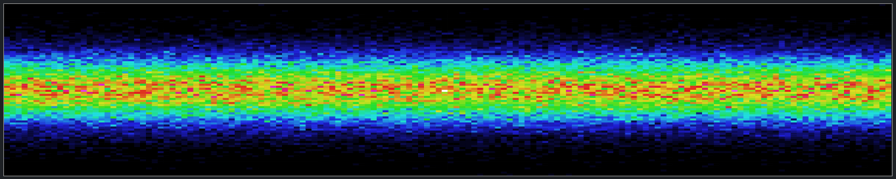

# uPlot Lazy Interface

Simplified interface for [uPlot](https://github.com/leeoniya/uPlot) the lightweight (~30KB), super fast (check the benchmarks) chart library.  
  
uPlot is a great library to visualize time series data, but getting started can be a bit complicated due to the many settings options and the interface that was designed to optimize performance.
If you don't need to tweak your charts down to the last detail but just want to quickly plot some basic point-, line- or bar-charts with reasonable defaults then 'uPlot-lazy' (~5KB) is the right extension for you ;-).
  
## Quick start

First include the uPlot library then add uPlot-lazy like this:
```
<script src="uPlot.iife.min.js"></script>
<link rel="stylesheet" href="uPlot.min.css">
<script src="uPlot-lazy.min.js"></script>
```

All "lazy" interfaces will be available via: `uPlot.lazy`.  
To plot a graph with default settings (points connected by straight lines) simply use:
```
<div id="my-chart"></div>

...
var x = [0, 1, 2, 3, 4];
var y1 = [0, 15, 0, -10, 0];
var y2 = [5, 5, 5, 5, 5];
var plot = uPlot.lazy.plot({
    targetElement: document.getElementById("my-chart"),
    title: "Default Settings",
    data: [x, y1, y2]
});
```

This will use the default `drawType: "line_linear"` with small points and the default color palette `uPlot.lazy.colorPalette`.  
Check out the [source code](src/uPlot-lazy.js) or the [first example](examples/index.html) to get a list of all default settings.  
  
You can change 'drawType' (points, line_linear, line_smooth, bars, custom), 'points' style, 'stroke' colors, 'fill' colors and much more. 
For example:
```
var plot = uPlot.lazy.plot({
    targetElement: document.getElementById("plot-1"),
    title: "Custom smooth line and area fill",
    drawType: 'line_smooth',
    points: [{show: true, size: 8, fill: '#efefef'}, {show: false}],
    fill: [null, "#efefef1a"],
    strokeWidth: 1,
    showLegend: true,
    yLabel: ["signal", "base line"],
    data: [x, y1, y2]
});
```

For plots that get new data every n time-steps you can use the series feature:
```
var maxDataPoints = 150;	//if you add more than this the oldest values will be dropped
var autoSeries = new uPlot.lazy.AutoSeries(document.getElementById("plot-2"), maxDataPoints, {
	x0: 0, 
	xStep: 1,
	//xIsTimestamp: true,	//alternative to x0 + xStep -> use UNIX time
	rememberMax: true
}, {
	title: "Sine Waves",
	drawType: "line_linear",
	pointSize: 4,
	pointWidth: 1,
	fill: ["#e24d421a", "#3caea31a"],
	//yRange: [-10, 10],	//use if 'rememberMax' is false
	showLegend: true,
	xLabel: "x",
	yLabel: ["Sine A", "Sine B"]
});
autoSeries.addValues(y1_i, y2_i);
autoSeries.draw();
```

BETA: If you have a series of arrays that you want to plot all at once a heatmap can be a good choice:
```
var heatmap = new uPlot.lazy.Heatmap(document.getElementById("plot-3"), {
	dataPixelWidth: 4,
	dataPixelHeight: 4,
	colorIndex: 4,		//0: grayscale, 1: blue to red, 2: 240-HSL, 3: HSL+60, 4: Extended HSL (best range)
	maxDataPoints: 150
});
heatmap.addDataArray([1, 2, 3, 4, 3, 2, 1]);
heatmap.draw();
```

## Examples

See 'examples' folder or hosted versions:
* [Example 1: Basics](https://byteteilchen.de/uplot-lazy/index.html)
* [Example 2: Dynamic Series](https://byteteilchen.de/uplot-lazy/index2.html)
* [Example 3: More options and heatmap](https://byteteilchen.de/uplot-lazy/index3.html)

## Screenshots

<p>DrawType: 'line_linear'</p>
<p align="center">
  
</p>
<p>DrawType: 'points'</p>
<p align="center">
  
</p>
<p>DrawType: 'line_smooth'</p>
<p align="center">
  
</p>
<p>DrawType: 'bars'</p>
<p align="center">
  
</p>
<p>Custom drawType (and custom colors)</p>
<p align="center">
  
</p>
<p>Heatmap</p>
<p align="center">
  
</p>

## Roadmap

* Add lazy interface for trend-lines
* tbd

## More Credits

* [uPlot](https://github.com/leeoniya/uPlot) - MIT License
* lazy.histogram - MIT License - Original: https://github.com/eoinmurray/histogram
* Gaussian distribution - MIT License - Original: https://github.com/errcw/gaussian

## All Options

### Plot

```
{
	targetElement: document.getElementById("plot-1"),
	data: [xPoints, yPoints1, yPoints2],
	width:	480,				//leave undefined for targetElement width
	height: 240,				//leave undefined for targetElement height
	title: "Custom smooth line and area fill",
	drawType: "line_smooth",	//"points", "line_linear", "line_smooth", "bars", "bars_thin", custom
	//showPoints: false,
	//pointSize: 6,				//size for every point (low priority)
	//pointWidth: 1,			//(border) width for every point (low priority)
	//points: {					//use one object for all or array of objects for each series,
	//	show: true,				//... missing fields are filled with defaults
	//	size: 6,				//... high priority
	//	width: 1,
	//	stroke: "#ffffff",
	//	fill: "#aaaaaa"
	//},
	points: [{show: true, size: 8, fill: '#efefef'}, {show: false}],
	//stroke: "#e24d42",		//first line color (rest is taken from default color palette)
	stroke: ["#e24d42", "#3caea3"],
	strokeWidth: 1,
	//fill: "#efefef1a",		//first fill color (rest is taken from default color palette)
	fill: [null, "#efefef1a"],
	showLegend: false,
	isTime: false,
	//xRangeAuto: true,
	xRange: [-1, 1],
	//yRangeAuto: true,
	yRange: [-20, 20],
	showAxisX: true,
	xLabel: "x",
	showAxisY: true,
	yLabel: ["y1", "y2"],
	axisStroke: "#c7d0d9",
	axisGridStroke: "#2c3235",
	axisFont: "10px sans-serif",
	axisTickSize: 1,
	axisGridSize: 1,
	axisSizeX: 50,
	axisSizeY: 50,
	labelTransform: [function(u, xv, space){ return xv.map(t => t + '° C'); }]		//transform labels of each axis (i=0..n)
}
```

