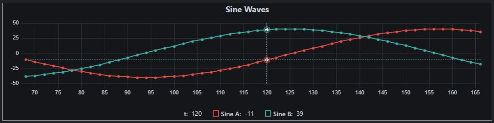
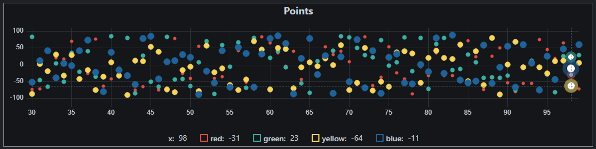
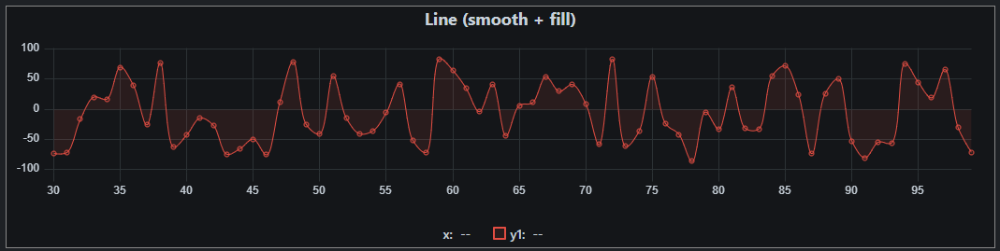
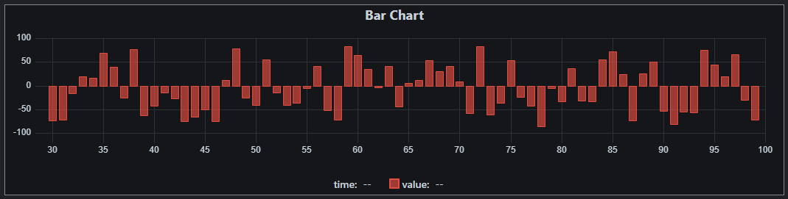
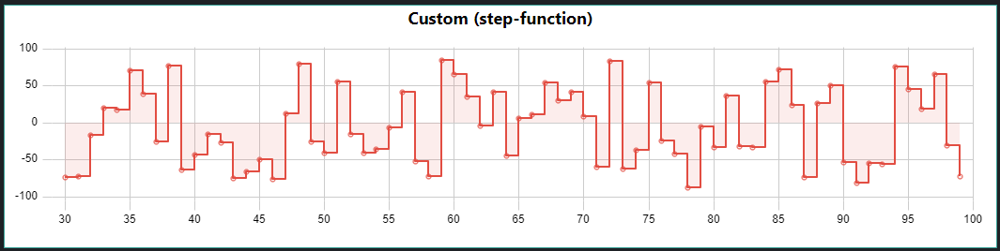

# uPlot Lazy Interface

Simplified interface for [uPlot](https://github.com/leeoniya/uPlot) the lightweight (~30KB), super fast (check the benchmarks) chart library.  
  
uPlot is a great library to visualize time series data, but getting started can be a bit complicated due to the many settings options and the interface that was designed to optimize performance.
If you don't need to tweak your charts down to the last detail but just want to quickly plot some basic point-, line- or bar-charts with reasonable defaults then 'uPlot-lazy' (~5KB) is the right extension for you ;-).
  
## Quick start

First include the uPlot library then add uPlot-lazy like this:
```
<script src="uPlot.iife.min.js"></script>
<link rel="stylesheet" href="uPlot.min.css">
<script src="uPlot-lazy.min.js"></script>
```

All "lazy" interfaces will be available via: `uPlot.lazy`.  
To plot a graph with default settings (points connected by straight lines) simply use:
```
<div id="my-chart"></div>

...
var x = [0, 1, 2, 3, 4];
var y1 = [0, 15, 0, -10, 0];
var y2 = [5, 5, 5, 5, 5];
var plot = uPlot.lazy.plot({
    targetElement: document.getElementById("my-chart"),
    title: "Default Settings",
    data: [x, y1, y2]
});
```

This will use the default `drawType: "line_linear"` with small points and the default color palette `uPlot.lazy.colorPalette`.  
Check out the [source code](src/uPlot-lazy.js) or the [first example](examples/index.html) to get a list of all default settings.  
  
You can change 'drawType' (points, line_linear, line_smooth, bars, custom), 'points' style, 'stroke' colors, 'fill' colors and much more. 
For example:
```
var plot = uPlot.lazy.plot({
    targetElement: document.getElementById("plot-1"),
    title: "Custom smooth line and area fill",
    drawType: 'line_smooth',
    points: [{show: true, size: 8, fill: '#efefef'}, {show: false}],
    fill: [null, "#efefef1a"],
    strokeWidth: 1,
    showLegend: true,
    yLabel: ["signal", "base line"],
    data: [x, y1, y2]
});
```


## Examples

See 'examples' folder or https://byteteilchen.de/uplot-lazy/index.html and https://byteteilchen.de/uplot-lazy/index2.html

## Roadmap

* Add lazy interface for trend-lines
* Add heatmap support
* tbd

## Screenshots

<p>DrawType: 'line_linear'</p>
<p align="center">
  
</p>
<p>DrawType: 'points'</p>
<p align="center">
  
</p>
<p>DrawType: 'line_smooth'</p>
<p align="center">
  
</p>
<p>DrawType: 'bars'</p>
<p align="center">
  
</p>
<p>Custom drawType (and custom colors)</p>
<p align="center">
  
</p>

## More Credits

* [uPlot](https://github.com/leeoniya/uPlot) - MIT License
* lazy.histogram - MIT License - Original: https://github.com/eoinmurray/histogram
* Gaussian distribution - MIT License - Original: https://github.com/errcw/gaussian
